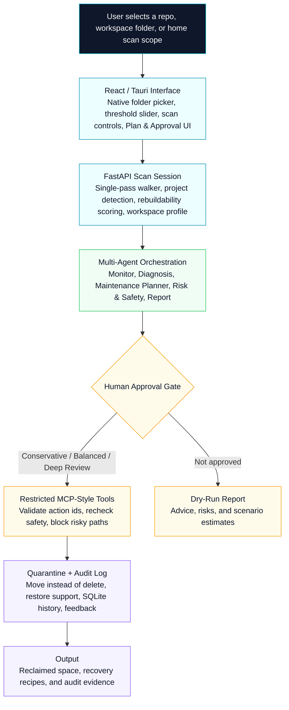
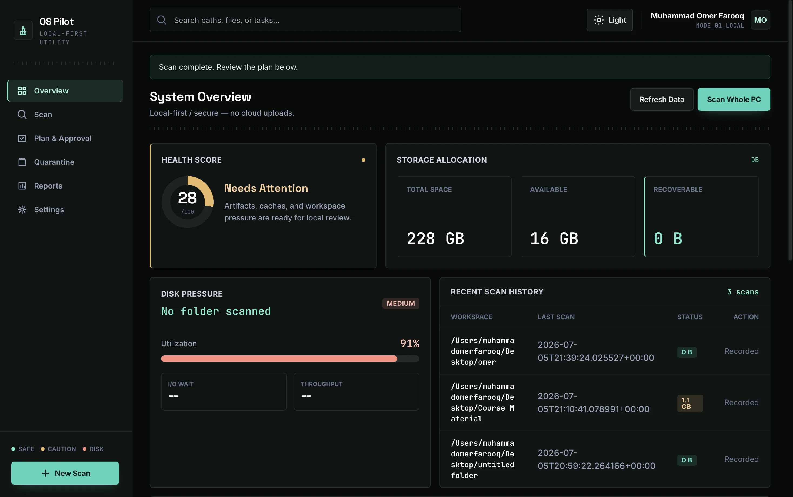
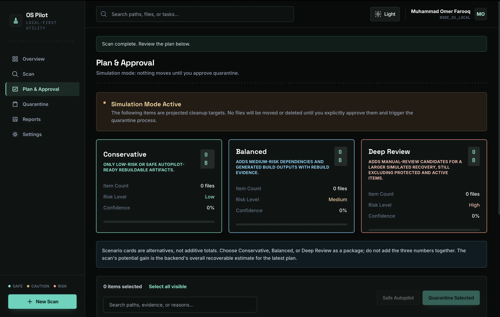
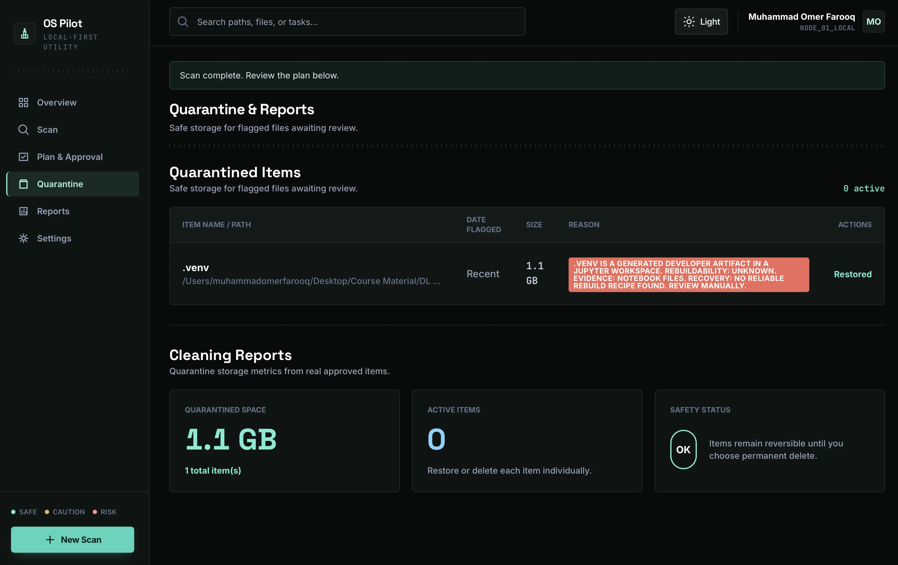

<div align="center">

<!-- Animated Header Banner -->


<br/>

<!-- Badge Row 1 -->

&nbsp;

&nbsp;

&nbsp;


<br/><br/>

<!-- Badge Row 2 -->

&nbsp;

&nbsp;

&nbsp;


<br/><br/>

**OS Pilot helps developers understand laptop slowdowns, identify performance pressure, and safely recover wasted storage from rebuildable project artifacts.**

</div>

---


<br/>

<div align="center">

## OS Pilot Multi-Agent Recovery Pipeline



</div>

---


## Problem

Developer laptops quietly fill up with old `node_modules`, virtual environments, build artifacts, Python caches, notebook checkpoints, and large forgotten files. Heavy background apps can also create RAM pressure.

Generic cleaner apps can find large folders, but they usually do not understand whether a development artifact is safely rebuildable from `package-lock.json`, `requirements.txt`, `pyproject.toml`, notebooks, or other project evidence.

---

## Solution

OS Pilot observes local system metrics, scans a user-selected folder or user-owned home scope, detects project type, scores artifact rebuildability, creates recovery recipes, validates safety with hard-coded rules, waits for human approval, and moves approved cleanup items to quarantine instead of deleting them.

The workflow is a four-part loop: profile the workspace, rank safe reclaim opportunities, compare Conservative / Balanced / Deep Review cleanup scenarios, then execute only approved items through quarantine with full restore history. Each scan stores a compact local snapshot so the agent can explain workspace growth or shrinkage over time.

---

## What Makes It Different From A Cleaner

<table>
<tr>
<td width="50%">

### AI Workspace Intelligence

- **Project-aware scanning** for Node, Next.js, Python, Jupyter, Rust, Go, Java, Ruby, PHP, Dart/Flutter, and ML-style folders
- **Manifest evidence checks** using files such as `package-lock.json`, `requirements.txt`, `pyproject.toml`, and notebooks
- **Rebuildability scoring** across High, Medium, Low, Unknown, and Not Rebuildable
- **Recovery recipes** such as `npm ci` or `python -m venv .venv && pip install -r requirements.txt`
- **Scan-delta memory** to explain workspace growth or shrinkage between runs
- **Restore feedback learning** that lowers confidence for artifact types users choose to restore

</td>
<td width="50%">

### Safety-First Automation

- **No arbitrary shell access**; actions go through restricted local tools
- **No automatic permanent delete**; approved items move to quarantine first
- **No automatic process killing**; active project-linked paths are protected
- **Symlink and identity revalidation** immediately before quarantine
- **Server-governed Safe Autopilot** for stale, rebuildable, manifest-backed artifacts only
- **Audit logs and restore history** for every important cleanup action

</td>
</tr>
</table>

---

## Demo Video

```md
[Watch the OS Pilot demo on YouTube](https://www.youtube.com/watch?v=YOUR_VIDEO_ID)
```

---

## Product Screenshots

<div align="center">



<br/><br/>

<table>
<tr>
<td width="50%">

</td>
<td width="50%">

</td>
</tr>
</table>

</div>

---

## Kaggle Capstone Concepts Demonstrated

<div align="center">

| Concept | Where It Is Demonstrated |
| --- | --- |
| **Agent / Multi-Agent System** | `agents/orchestrator_agent.py` coordinates Monitor, Diagnosis, Maintenance Planner, Risk & Safety, and Report agents |
| **MCP Server / Restricted Tools** | `mcp_server/server.py` exposes a narrow allowlist of local tools instead of arbitrary shell access |
| **Antigravity** | Backend and frontend can be launched from Antigravity's terminal during the demo workflow |
| **Security Features** | Server-side scan sessions, protected-path blocking, symlink blocking, identity revalidation, active-process blocks, quarantine, restore, and audit logs |
| **Deployability** | Local web run commands plus the Tauri desktop shell documented in `docs/desktop_app.md` and `docs/deployability.md` |
| **Agent Skills** | `agents/skills.py` defines the observation, diagnosis, planning, safety, and reporting skills used by the pipeline |

</div>

See [Course Concepts](docs/course_concepts.md) for the judge-facing mapping.

---

## Tech Stack

<div align="center">

| Technology | Purpose |
| --- | --- |
| **React + Vite + Tailwind** | Frontend UI |
| **Tauri** | Desktop app shell |
| **FastAPI** | Backend API and scan sessions |
| **Groq AI** | Structured diagnosis with deterministic fallback |
| **Restricted MCP-style tools** | Safe local scanning, validation, quarantine, restore, and reporting actions |
| **SQLite** | Audit, quarantine, feedback, and scan snapshot storage |
| **Python 3** | Core backend, agent, scanner, and safety logic |

</div>

---

## Project Structure

```text
ospilot-agent/
├── agents/             # AI agents for monitoring, diagnosis, planning, and safety
├── api/                # FastAPI backend endpoints and session management
├── core/               # Core logic for workspace profiling, scanning, and metrics
├── docs/               # Architecture, safety model, deployability, and writeup docs
├── frontend/           # React + Vite + Tailwind UI and Tauri desktop shell
├── mcp_server/         # Restricted MCP-style Python tools
├── scripts/            # Utility scripts such as weekly_scan.py
├── tests/              # Backend, agent, scanner, and safety tests
├── config.py           # Application configuration
├── README.md           # Project overview
└── requirements.txt    # Python dependencies
```

---

## Setup & Run

### Backend

```bash
python3 -m venv .venv
source .venv/bin/activate
pip install -r requirements.txt
cp .env.example .env
```

Optional Groq setup in `.env`:

```text
GROQ_API_KEY=your_key_here
GROQ_MODEL=gpt-oss-20b
```

If no Groq key is configured, or if the model call fails, OS Pilot runs in deterministic fallback mode. Safety validation never depends on Groq.

### Frontend

```bash
cd frontend
npm install
```

### Run The App

Start the backend and frontend in two separate terminals. The same commands work in a standard shell or in Antigravity's terminal.

```bash
# Terminal 1 - Backend
source .venv/bin/activate
uvicorn api.main:app --reload --port 8000

# Terminal 2 - Frontend
cd frontend
npm run dev
```

Open [http://localhost:5173](http://localhost:5173).

### Desktop Shell

```bash
cd frontend
npm run desktop:dev
```

See [Desktop App](docs/desktop_app.md) for the Tauri build path.

---

## Scanning Real Local Data

1. Open [http://localhost:5173](http://localhost:5173), or use the desktop shell.
2. Use the large file threshold slider from 30 MB to 5 GB. The default is 30 MB.
3. Click **Scan a Specific Folder** to open the native Mac folder picker and scan the selected path.
4. Click **Scan Whole PC** to scan your user-owned computer space while OS protected folders remain blocked.

The scan uses a single-pass optimized walker that prunes junk directories such as `node_modules`, `.venv`, `__pycache__`, and build outputs before recursing into them, making it practical on large developer workspaces.

### Optional Demo Workspace

```bash
python demo/create_demo_workspace.py
```

The script creates safe fake Node, Python, notebook, cache, build, and large-file artifacts under `demo/demo_workspace/`.

---

## Plan & Approval UI

After a scan, the **Plan & Approval** tab shows:

- **Workspace profile** with detected project types, manifest markers, artifact counts, candidate space, and linked live process signals
- **Structured agent diagnosis** with summary, top risks, urgency, recommended scenario, confidence, and previous-scan delta
- **Cleanup scenarios** for Conservative, Balanced, and Deep Review estimates
- **Search and filtering** for large result sets by folder, reason, or risk
- **Cleanup action table** with path, size, risk, confidence, reason, status, and approval checkboxes
- **Rebuildability-aware planning** with project type, manifest evidence, rebuildability, and recovery recipe
- **Safe Autopilot** for backend-approved stale rebuildable artifacts only
- **Manual Review** separation for advisory, blocked, protected, or risky items
- **Before/after reporting** with scenario estimates, quarantine counts, recovery recipes, and audit summary

---

## Weekly Scan

OS Pilot is on-demand by default. Users can optionally enable a weekly read-only scan from the UI.

- **macOS:** installs a `launchd` user agent at `~/Library/LaunchAgents/com.ospilot.weekly-scan.plist`
- **Linux:** installs a user `crontab` entry
- **Reports:** writes Markdown and HTML reports to `.ospilot_data/reports/`
- **Safety:** weekly scans never quarantine or delete files automatically

Manual run:

```bash
source .venv/bin/activate
python scripts/weekly_scan.py
```

---

## Safety Guarantees

- No arbitrary shell access
- No automatic permanent delete
- No automatic process killing
- No registry edits or OS repair
- No unsafe raw full-disk scan
- Protected system paths are blocked
- Folder selection is user-driven through the app
- Running project-linked processes block quarantine for matching paths
- Approved cleanup actions are rechecked immediately before quarantine
- Symlink paths and changed filesystem identities are blocked at execution time
- Cleanup approvals use server-side scan sessions, not browser-submitted cleanup plans
- Scenario loading only selects backend-issued action ids
- Safe Autopilot is server-governed and cannot be pointed at arbitrary files by the UI
- Quarantined items can be restored
- Permanent removal is available only after quarantine
- Every important action is logged
- External LLM prompts use redacted, aggregated scan summaries

---

## Project Docs

- [Architecture](docs/architecture.md)
- [Safety Model](docs/safety_model.md)
- [MCP Tools](docs/mcp_tools.md)
- [Course Concepts](docs/course_concepts.md)
- [Deployability](docs/deployability.md)
- [Writeup](docs/writeup.md)
- [Desktop App](docs/desktop_app.md)

---

## License

This project is licensed under the [MIT License](LICENSE).

---


<div align="center">

<br/>

[](https://github.com/omerfarooq223/ospilot-agent)
&nbsp;
[](https://omerfarooq223.github.io)
&nbsp;
[](https://kaggle.com)

<br/>

[](#demo-video)
&nbsp;
[](docs/course_concepts.md)
&nbsp;
[](docs/safety_model.md)

<br/>


**Star this repo if OS Pilot helped you recover a cleaner developer workspace.**

</div>
