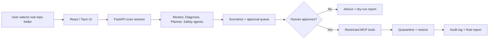

# OS Pilot

OS Pilot is a local-first AI developer workspace recovery agent for the Kaggle AI Agents capstone. It helps students and developers understand laptop slowdowns, identify performance pressure, and safely recover wasted storage from rebuildable project artifacts.

## Problem

Developer laptops often fill up with old `node_modules`, virtual environments, build artifacts, Python caches, notebook checkpoints, and large forgotten files. Heavy background apps can also create RAM pressure. Generic cleaner apps can find large folders, but they usually do not understand whether a development artifact is safely rebuildable from `package-lock.json`, `requirements.txt`, `pyproject.toml`, notebooks, or other project evidence.

## Solution

OS Pilot observes local system metrics, scans a user-selected folder or the user-owned home scope, detects project type, scores artifact rebuildability, creates recovery recipes, validates safety with hard-coded rules, waits for human approval, and moves approved cleanup items to quarantine instead of deleting them.

The current workflow is the four-part loop from the research report: profile the selected workspace or user-owned scan scope, rank safe reclaim opportunities, compare Conservative / Balanced / Deep Review cleanup scenarios, then execute only approved items through quarantine with full restore history. Each scan also stores a compact local snapshot so the agent can explain workspace growth or shrinkage on later scans.

## What Makes It Different From A Cleaner

A normal cleaner finds junk. OS Pilot understands developer workspaces:

- Detects Node, Next.js, Python, Jupyter, Rust, Go, Java, Ruby, PHP, Dart/Flutter, and ML-style project context.
- Checks manifest/lockfile evidence such as `package-lock.json`, `requirements.txt`, `pyproject.toml`, and notebooks.
- Assigns rebuildability: High, Medium, Low, Unknown, or Not Rebuildable.
- Shows exact recovery recipes such as `npm ci` or `python -m venv .venv && pip install -r requirements.txt`.
- Keeps large model/checkpoint-style files as manual review instead of pretending they are safe junk.
- Links live processes back to the selected workspace and blocks quarantine for active paths.
- Simulates cleanup scenarios before execution so users can compare estimated reclaimed space.
- Produces structured agent output: summary, top risks, recommended scenario, urgency level, and confidence.
- Learns from restore feedback by lowering future confidence for similar artifacts the user chose to keep.

## Architecture



Main pieces:

- JavaScript UI (React + Vite + Tailwind)
- FastAPI backend
- Restricted MCP-style Python tools
- Multi-agent orchestration
- Groq-backed structured diagnosis with deterministic fallback
- Rebuildability-aware project scanner and recovery recipes
- Workspace profiler, scan-delta memory, dormancy ranking, scenario planner, process linkage, and before/after simulator
- SQLite audit, quarantine, feedback, and scan snapshot storage

OS Pilot is **on-demand by default**. Users can optionally enable a **weekly read-only scan** from the UI, which installs a local scheduler (`launchd` on macOS or `cron` on Linux). Scheduled scans write human-readable reports and never quarantine or delete files automatically.

OS Pilot also includes **Safe Autopilot**. After a scan, the backend automatically ranks cleanup candidates and marks only stale, rebuildable, manifest-backed artifacts as Autopilot-ready. When the user clicks **Run Safe Autopilot**, the browser sends only the scan session id; the backend chooses the eligible items from the server-side plan and quarantines them with audit logs. The browser cannot submit its own cleanup plan.

For a desktop-style experience, OS Pilot also includes a Tauri shell so the React UI can open in its own app window instead of a browser tab.

## Course Concepts Demonstrated

OS Pilot demonstrates more than the minimum three course concepts required by the capstone rubric:

| Concept | Where it is demonstrated |
| --- | --- |
| Agent / multi-agent system | Code: `agents/orchestrator_agent.py` coordinates Monitor, Diagnosis, Maintenance Planner, Risk & Safety, and Report agents. |
| MCP server / restricted tools | Code: `mcp_server/server.py` exposes a narrow allowlist of local tools instead of arbitrary shell access. |
| Antigravity | Video: launch the backend and frontend from Antigravity's terminal before switching to the app demo. |
| Security features | Code and video: server-side scan sessions, protected-path blocking, symlink blocking, identity revalidation, active-process blocks, quarantine, restore, and audit logs. |
| Deployability | Video and docs: local web run commands plus the Tauri desktop shell documented in `docs/desktop_app.md` and `docs/deployability.md`. |
| Agent skills | Code: `agents/skills.py` names the observation, diagnosis, planning, safety, and reporting skills used by the multi-agent pipeline. |

See [Course Concepts](docs/course_concepts.md) for the judge-facing mapping.

## Project Structure

```text
.
├── agents/             # AI agents for monitoring, diagnosis, planning, and safety
├── api/                # FastAPI backend endpoints and session management
├── core/               # Core logic for workspace profiling, scanning, and metrics
├── docs/               # Project documentation (architecture, safety model, etc.)
├── frontend/           # React + Vite + Tailwind UI
├── mcp_server/         # Restricted MCP-style Python tools
├── scripts/            # Utility scripts (e.g., weekly_scan.py)
├── tests/              # Test suite for backend and agent safety
├── config.py           # Application configuration
├── README.md           # This file
└── requirements.txt    # Python dependencies
```

## Setup

### Backend

```bash
python3 -m venv .venv
source .venv/bin/activate
pip install -r requirements.txt
cp .env.example .env
```

Optional Groq setup in `.env`:

```text
GROQ_API_KEY=your_key_here
GROQ_MODEL=gpt-oss-20b
```

If no Groq key is configured, or if the model call fails, OS Pilot runs in deterministic fallback mode. Safety validation never depends on Groq.

### Frontend

```bash
cd frontend
npm install
```

## Run

Start the backend and frontend in two separate terminals. For the submission video, open these terminals inside **Antigravity** so the video demonstrates that course concept directly.

Terminal 1 — API:

```bash
source .venv/bin/activate
uvicorn api.main:app --reload --port 8000
```

Terminal 2 — UI:

```bash
cd frontend
npm run dev
```

Open [http://localhost:5173](http://localhost:5173).

Quick command summary:

```bash
# Backend
source .venv/bin/activate
uvicorn api.main:app --reload --port 8000

# Frontend
cd frontend
npm run dev
```

### Weekly scan (opt-in)

In the UI, use **Enable weekly scan** to install a local scheduler:

- **macOS:** `launchd` user agent (`~/Library/LaunchAgents/com.ospilot.weekly-scan.plist`)
- **Linux:** user `crontab` entry

Weekly scans are **read-only**. They write Markdown and HTML reports to `.ospilot_data/reports/` and do not quarantine or delete anything until you approve cleanup in the UI.

Manual CLI run:

```bash
source .venv/bin/activate
python scripts/weekly_scan.py
```

## Scanning Real Local Data

1. Open [http://localhost:5173](http://localhost:5173), or use the desktop shell described in [Desktop App](docs/desktop_app.md).
2. Use the folder explorer to browse major locations such as Home, Desktop, Documents, Downloads, Applications, and Volumes. You can still paste a path directly; pasted paths can include `~`, quotes, `file://` URLs, or a trailing comma.
3. Use the **large file threshold slider** (30 MB - 5 GB) to set the minimum file size to report. Default is 30 MB.
4. Click **Scan Folder** to scan the selected path.
5. Click **Home Scan** to scan the user-owned home area (`~`) while continuing to skip protected OS folders.

The scan uses a single-pass optimised walker that prunes junk directories (`node_modules`, `.venv`, `__pycache__`, etc.) before recursing into them, making it practical on large trees with hundreds of thousands of files.

### Optional Demo Workspace

If you want a safe reproducible scan target instead of using personal folders, create the bundled demo workspace:

```bash
python demo/create_demo_workspace.py
```

The script creates small fake Node, Python, notebook, cache, build, and large-file artifacts under `demo/demo_workspace/`. You can then scan that folder from the UI.

### Submission Demo Path

For the Kaggle capstone video, the recommended demo is a real local GitHub repositories folder with accumulated `node_modules`, virtual environments, caches, and build outputs. This shows OS Pilot working on meaningful local data. The demo should show the scan result, workspace profile, rebuildability evidence, scenario estimates, approval step, quarantine, restore, and final report.

## Plan & Approval UI

After a scan the **Plan & Approval** tab shows:

- **Workspace profile** — detected project types, manifest markers, artifact counts, candidate space, and linked live process signals.
- **Structured agent diagnosis** — summary, top risks, urgency level, recommended scenario, confidence, and previous-scan delta when available.
- **Cleanup scenarios** — Conservative, Balanced, and Deep Review estimates that can be loaded into the approval queue.
- **Search/filter** — narrow large result sets by folder, reason, or risk.
- **Cleanup action table** — path, size, risk, confidence, reason, status, and approval checkboxes.
- **Rebuildability-aware planning** — reasons include project type, manifest evidence, rebuildability, and recovery recipe.
- **Safe Autopilot** — one-click quarantine for backend-approved stale rebuildable artifacts only.
- **Manual Review** — advisory and blocked/protected items are separated from reversible cleanup actions.
- **Before/after reporting** — report export includes scenario estimates, quarantine counts, recovery recipes, and audit summary.

In the app:

1. Browse to a real folder or choose **Home Scan** for a safe user-owned scan scope.
2. Click **Scan Folder**.
3. Review count summary, search/filter results, and sort results by size or folder.
4. Approve selected cleanup items.
5. Quarantine approved items.
6. Restore an item from quarantine.
7. Review the report and audit events.
8. Export HTML/PDF evidence if needed for submission.

## Safety Guarantees

- No arbitrary shell access.
- No automatic permanent delete.
- No automatic process killing.
- Running project-linked processes block quarantine for the matching path.
- No registry edits or OS repair.
- No unsafe raw full-disk scan.
- Folder selection is user-driven through the in-app explorer, and **Home Scan** maps to the user-owned home area while protected OS paths remain blocked.
- Approved cleanup actions are rechecked immediately before quarantine: symlink paths, changed filesystem identities, and newly active project-linked processes are blocked.
- Quarantine records preserve artifact and project metadata so restore feedback can tune future confidence.
- Cleanup approvals use a server-side scan session, not a browser-submitted cleanup plan.
- Scenario loading only selects backend-issued action ids; execution revalidates those ids before moving files.
- Safe Autopilot is server-governed: the UI cannot choose arbitrary files for automated quarantine.
- Optional weekly scan is opt-in only and report-only until you approve cleanup in the UI.
- Protected system paths are blocked.
- Cleanup requires human approval.
- Quarantined items can be restored.
- Permanent removal is available only from quarantine after the item has already been moved out of its original location.
- Every important action is logged.
- External LLM prompts use redacted, aggregated scan summaries rather than raw full paths or process command lines.

## Project Docs

- [Architecture](docs/architecture.md)
- [Safety Model](docs/safety_model.md)
- [MCP Tools](docs/mcp_tools.md)
- [Course Concepts](docs/course_concepts.md)
- [Deployability](docs/deployability.md)
- [Writeup](docs/writeup.md)
- [Desktop App](docs/desktop_app.md)

## Kaggle Submission Links

Fill these in after publishing the final submission materials:

- Kaggle writeup: see [Writeup](docs/writeup.md)
- YouTube demo:
- Screenshots/GIF:
