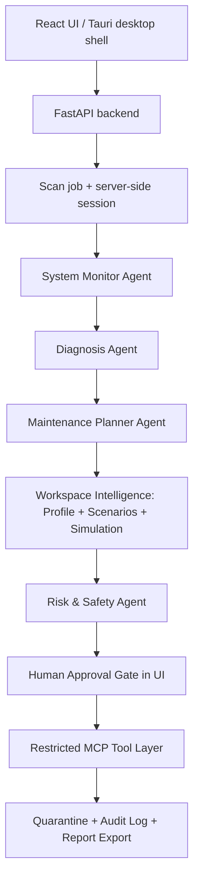
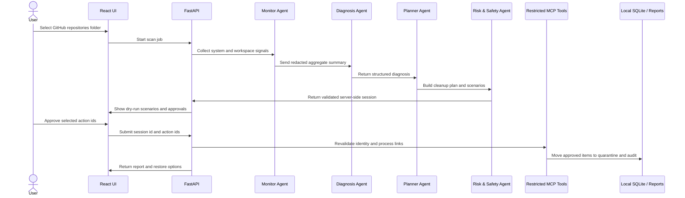
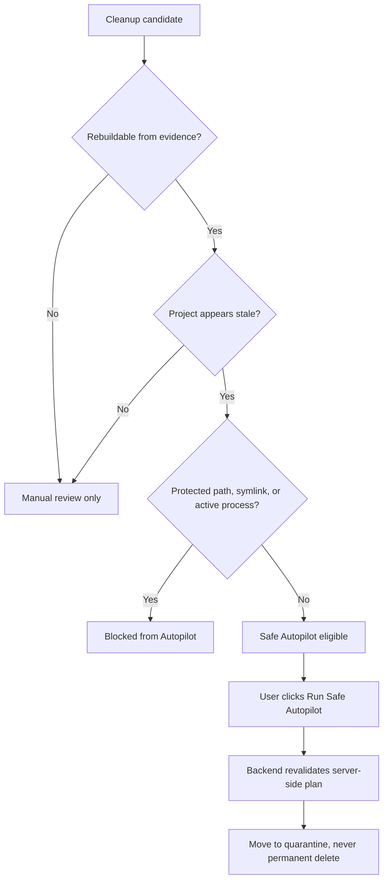

# OS Pilot Architecture

OS Pilot is a local-first AI system health agent. It separates observation, structured reasoning, safety validation, user approval, and reversible execution.

## Agent Loop

## Data Flow

1. The user opens the React app or desktop shell.
2. The folder explorer loads major locations such as Home, Desktop, Documents, Downloads, Applications, and Volumes.
3. The user browses directories, optionally ignores folders, and selects the exact folder to scan, or clicks **Home Scan** for a safe user-owned scan scope.
4. The frontend calls `POST /api/scan/start`.
5. The backend creates a scan job and returns progress through `GET /api/scan/jobs/{job_id}`.
6. The monitor agent collects CPU, RAM, disk, process, and folder scan data.
7. The scanner detects project type, manifest evidence, rebuildability, filesystem identity, and recovery recipes for workspace artifacts.
8. Workspace intelligence profiles the selected root or user-owned scan scope, links live processes to project paths, applies restore-feedback confidence penalties, ranks candidates by dormancy/confidence, and builds Conservative, Balanced, and Deep Review scenarios.
9. The backend loads the previous scan snapshot for the same folder, if one exists.
10. The diagnosis agent receives an aggregated, redacted scan summary plus any scan delta and returns structured output: summary, top risks, recommended scenario, urgency level, and confidence.
11. The planner agent creates advisory recommendations and reversible cleanup actions.
12. The automation policy ranks candidates and marks stale rebuildable artifacts as Safe Autopilot eligible.
13. The safety agent blocks protected paths, risky actions, symlinks, and active-process-linked paths; weak-evidence generated-looking folders lose high-confidence rebuildability and require explicit review.
14. The backend stores the validated plan, structured diagnosis, workspace profile, scenarios, simulations, and scan delta in a server-side scan session, then saves a compact SQLite scan snapshot for future comparisons.
15. The user compares scenarios, searches/filters items, expands agent reasoning, and approves individual cleanup items in the UI.
16. Manual approval sends the scan session id and approved action ids to `POST /api/quarantine`.
17. Safe Autopilot sends only the scan session id to `POST /api/autopilot/quarantine`; the backend chooses eligible items from its own plan.
18. The tool layer revalidates approved ids, checks that each path's device/inode/mtime still match the reviewed scan item, blocks symlink or active-process-linked paths, quarantines approved items with artifact/project metadata, and writes audit events.
19. Restore events are recorded as local feedback so similar future candidates receive a lower confidence score.
20. The report agent summarizes before/after state, structured diagnosis, workspace profile, scenario estimates, project types, rebuildable artifacts, automation candidates, and recovery recipes.

## Frontend / Backend Split

- `frontend/` owns presentation, folder navigation, progress/cancel UI, approval checkboxes, search/filter, and user messaging.
- `frontend/src-tauri/` provides the desktop-window wrapper.
- `api/main.py` owns HTTP boundaries, scan jobs, server-side scan sessions, ignore-list endpoints, report export, and calls the existing agent orchestrator.
- Agents and MCP tools stay Python-only so safety rules remain centralized.

## Local Persistence

- `.ospilot_data/ignored_folders.json` stores folders the user does not want scanned.
- `.ospilot_data/scan_history.json` stores recent scan summaries for the storage timeline.
- SQLite stores quarantine records, audit events, scan snapshots, and restore-feedback signals.
- `.ospilot_data/reports/` stores weekly Markdown/HTML reports.

## Scheduling

OS Pilot is **on-demand by default**. Users can opt in to a weekly scan from the UI:

1. Choose folder(s), weekday, and time.
2. Click **Enable weekly scan** to install `launchd` (macOS) or `cron` (Linux).
3. The job runs `scripts/weekly_scan.py`, which writes Markdown/HTML reports under `.ospilot_data/reports/`.
4. Click **Disable weekly scan** to remove the scheduler.

Scheduled scans are report-only. Cleanup still requires explicit approval in the UI. Scheduled scans also save scan snapshots, so future reports and interactive scans can explain how a workspace changed over time.

## Safe Autopilot

Safe Autopilot is the automation layer. It does not install software, kill processes, or delete files. It automatically identifies stale, rebuildable, manifest-backed artifacts, then lets the user trigger backend-governed quarantine. The browser cannot make an arbitrary file Autopilot-ready; eligibility is computed from the server-side plan and revalidated immediately before execution.

## Scenario Planner

Each scan produces three scenario cards:

- **Conservative**: low-risk and Safe Autopilot-ready rebuildable artifacts.
- **Balanced**: medium-risk dependency and generated output folders with rebuild evidence.
- **Deep Review**: the widest executable quarantine set while still excluding protected paths and active-process-linked items.

Scenario cards are simulations. Loading a scenario only checks its action ids in the approval queue; quarantine still requires a separate user action and backend validation.

## Developer Workspace Intelligence

OS Pilot's key distinction from a desktop cleaner is that it reasons about whether artifacts are rebuildable, whether the workspace appears active, and whether previous user feedback suggests caution. It detects project manifests and lockfiles, classifies project type across common developer ecosystems, links live processes by `cwd`, command line, or open files, attaches recovery recipes such as `npm ci`, `npm install`, `pip install -r requirements.txt`, `cargo build`, or `./gradlew build`, and stores scan deltas for trend-aware diagnosis.

## Safety Boundary

The LLM can suggest and explain through structured diagnosis output. It cannot execute arbitrary commands, delete files directly, kill processes, or override hard-coded path rules. Cleanup approvals are tied to the backend's server-side scan session, not to a browser-submitted cleanup plan. Execution rechecks path identity and live processes after approval, so stale plans cannot move changed paths.
