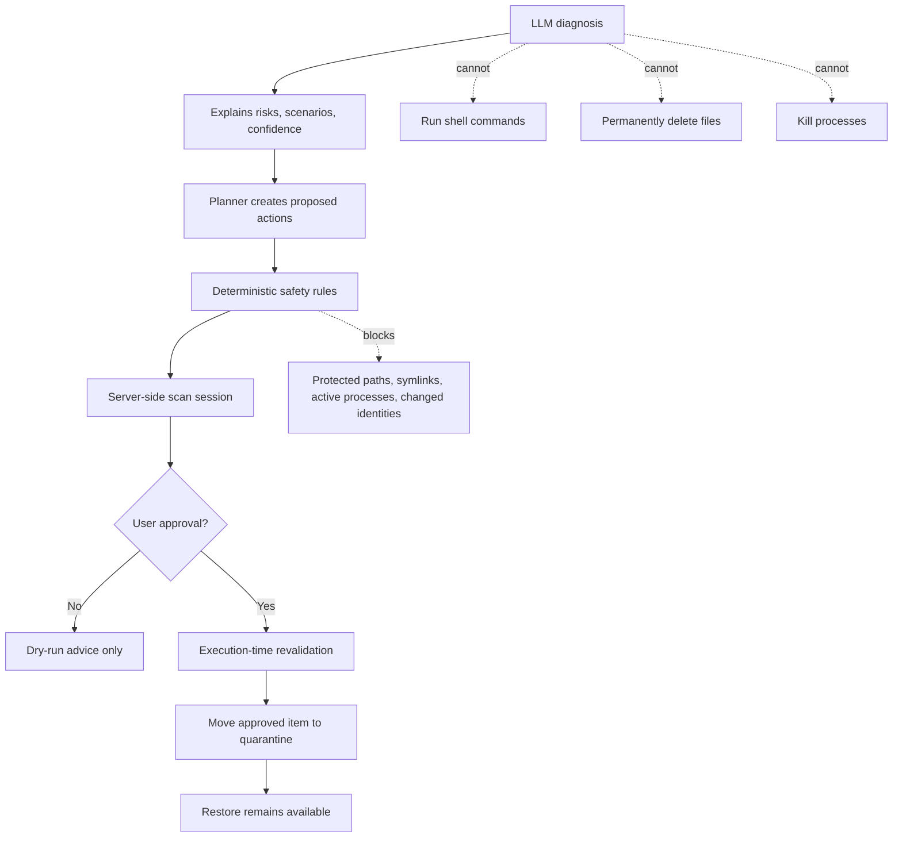

# OS Pilot Safety Model

OS Pilot is designed around local control and reversible actions.



## Guarantees

- No arbitrary shell access.
- No automatic permanent delete.
- No automatic process killing.
- No unsafe raw full-disk scan.
- Folder selection is user-driven through the in-app explorer.
- **Home Scan** scans the user-owned home area (`~`) and still relies on protected-path rules to avoid OS-controlled folders.
- Folders can be ignored by the user and are skipped by scan requests.
- Cleanup actions require human approval.
- Safe Autopilot can quarantine only server-approved stale rebuildable artifacts after the user clicks the Autopilot button.
- Cleanup scenarios are simulations until the user loads one and explicitly approves quarantine.
- Running processes linked to a workspace path block quarantine for that path.
- Approved files are moved to quarantine, not deleted.
- Quarantined items can be restored.
- Permanent removal is only available from quarantine after the item has already been moved out of its original location.
- Protected system paths are blocked by Python safety rules.
- Developer artifacts include project type, rebuildability, evidence, and recovery recipes.
- Rebuildability for broad cache/build names requires nearby project evidence; generated-looking folders without evidence do not receive high-confidence rebuildable labels and require explicit review.
- Unknown large files and likely model/checkpoint artifacts remain manual-review items.
- Every scan, plan, approval, quarantine, restore, block, and report is auditable.
- No background daemon by default.
- Optional weekly scan is opt-in from the UI and report-only until the user approves cleanup.
- Browser-submitted cleanup plans are not trusted. Quarantine requests use the backend's server-side scan session and approved action ids.
- Browser-submitted Autopilot selections are not trusted. Safe Autopilot uses only the backend's policy-approved candidates.
- Browser-submitted scenario contents are not trusted. Scenario loading selects only action ids from the backend plan, and execution revalidates them.
- Quarantine execution revalidates filesystem identity and live process links immediately before moving anything.
- Symlink paths are blocked from quarantine and kept out of automated cleanup.
- Quarantine records preserve artifact and project metadata so restore feedback can reduce confidence for similar future suggestions.
- Scan snapshots are stored locally so later diagnoses can describe workspace growth or shrinkage without sending raw paths to an external model.

## Protected Paths

macOS:

```text
/System
/Library
/bin
/sbin
/usr
/Applications
/private
```

OS Pilot allows user temp folders such as `/private/tmp` and `/private/var/folders` for tests and generated artifacts, while continuing to block system-level `/private` paths by default.

Windows compatibility:

```text
C:\Windows
C:\Program Files
C:\Program Files (x86)
```

## LLM Boundary

Groq is used for structured diagnosis when available. The model receives an aggregated scan summary and returns a JSON-like result with summary, top risks, recommended scenario, urgency level, and confidence. If the API key is missing or the request fails, OS Pilot uses deterministic fallback text and the same structured fields. Safety validation never depends on the LLM. External diagnosis prompts use redacted scan data: process command lines and full local paths are not sent to the LLM.

## Workspace Recovery Boundary

OS Pilot is not allowed to assume every large file is junk. It treats generated developer artifacts differently from user-created files:

- `node_modules` with a lockfile can be rebuilt with package-manager commands.
- `.venv` folders with requirements or environment files can be rebuilt from manifests.
- Rust `target`, Java/Gradle `.gradle`, JavaScript tooling caches, Dart/Flutter caches, and similar artifacts require nearby project markers before being treated as high-confidence rebuildable cleanup.
- Build/cache outputs are usually rebuildable by rerunning tests, notebooks, or builds, but generic build/cache folder names without project evidence do not receive high-confidence rebuildable labels.
- Model checkpoints, serialized models, videos, archives, and unknown large files require manual review.

## Safe Autopilot Boundary

Safe Autopilot is allowed to automate **selection and quarantine** only when all of these are true:

- The item is already in the backend's server-side scan session.
- The item is a reversible quarantine action.
- The project appears stale.
- The artifact is rebuildable from manifest or lockfile evidence, or is generated build/cache output.
- The path passes protected-path safety checks.
- No live process is linked to the item or its project root.
- The path is not a symlink and its filesystem identity still matches the scan-time device, inode, and mtime.

It is not allowed to permanently delete files, install updates, run arbitrary commands, disable startup items, kill processes, or scan OS-controlled disk roots by default.

## Scenario Boundary

The Conservative, Balanced, and Deep Review cards are planning aids:

- They estimate reclaimable bytes before execution.
- They exclude protected paths and active-process-linked items.
- They do not mutate files.
- They only load backend-generated action ids into the approval queue.
- Quarantine still requires explicit user approval and a server-side validation pass.
