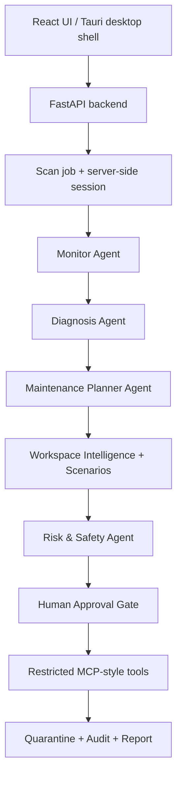

# OS Pilot: Local-First AI Developer Workspace Recovery Agent

## Summary

OS Pilot is a local-first AI agent that helps developers understand laptop slowdowns and safely recover storage from rebuildable project artifacts. It scans only user-approved folders, detects developer-specific waste such as `node_modules`, virtual environments, Python caches, build outputs, and notebook checkpoints, then explains what can be reclaimed and why.

The project is built for the Kaggle AI Agents capstone in the Concierge Agents track. It acts like a careful local maintenance assistant: it observes system and workspace signals, diagnoses pressure, creates cleanup scenarios, validates safety, asks for human approval, moves approved items to quarantine, supports restore, and records the result.

One-line pitch: **OS Pilot is a safe local AI maintenance agent that understands developer workspaces, identifies rebuildable artifacts, and executes only approved quarantine actions through restricted tools with rollback support.**

## Problem

Developer laptops often fill up slowly and invisibly. Old dependencies, virtual environments, caches, build folders, notebook checkpoints, and forgotten large files can occupy many gigabytes. At the same time, heavy background apps can create RAM and CPU pressure.

Generic cleaner apps can find large folders, but they usually do not understand developer context. A `node_modules` folder next to a lockfile is very different from an unknown model checkpoint or user-created archive. Developers need more than a file-size list: they need evidence, rebuildability, recovery instructions, and a reversible path back.

OS Pilot focuses on that gap.

## Solution

OS Pilot turns local system and workspace data into a safe maintenance plan.

The user selects a folder or runs a user-owned Home Scan. OS Pilot collects system metrics, process pressure, workspace markers, artifact sizes, project type, rebuildability evidence, and previous scan history. It then creates scenario cards such as Conservative, Balanced, and Deep Review so the user can compare risk and potential recovery before moving anything.

Cleanup is never automatic by default. The user must approve actions. Approved artifacts are moved to quarantine instead of being permanently deleted, and each quarantine record keeps the original path, size, reason, artifact name, project type, and restore status. If the user restores an item, OS Pilot records that feedback and lowers confidence for similar future suggestions.

## Why Agents

This is not just a file deletion task. A script can list large folders, but it does not naturally connect system pressure, project evidence, rebuildability, scan history, recovery recipes, safety policy, user approval, and reporting.

OS Pilot uses a multi-agent pipeline with explicit skills:

- **Monitor Agent:** observes CPU, RAM, disk, process, selected-folder, and workspace signals.
- **Diagnosis Agent:** turns redacted aggregate observations into structured diagnosis fields: summary, top risks, recommended scenario, urgency, and confidence. When Groq is unavailable, it returns deterministic fallback output with the same shape.
- **Maintenance Planner Agent:** creates advisory recommendations and reversible cleanup candidates with project type, rebuildability, evidence, recovery recipe, risk level, and action mode.
- **Risk & Safety Agent:** applies deterministic safety rules that override any LLM output.
- **Report Agent:** summarizes before/after state, quarantine results, recovery recipes, and audit history.

This agent structure makes the project useful because each role adds a different kind of judgment: observation, interpretation, planning, safety, and explanation.

## Architecture



The frontend is a React, Vite, and Tailwind app. The backend is FastAPI. The agent layer is Python. Local persistence uses SQLite for audit events, quarantine records, scan snapshots, and restore feedback. The app also includes a Tauri shell for a desktop-window experience.

The scan flow is:

```text
Observe -> Diagnose -> Plan -> Validate -> Approve -> Quarantine -> Report -> Restore
```

## Key Course Concepts Demonstrated

| Concept | How OS Pilot demonstrates it |
| --- | --- |
| Agent / multi-agent system | `agents/orchestrator_agent.py` coordinates Monitor, Diagnosis, Planner, Safety, and Report agents. `agents/skills.py` defines the role-specific agent skills. |
| MCP server / restricted tools | `mcp_server/server.py` exposes an allowlist of local tools. The agent can call specific scan, validation, quarantine, restore, and reporting tools, but cannot run arbitrary shell commands. |
| Antigravity | The demo video launches the backend and frontend from Antigravity's terminal before switching to the running app. |
| Security features | Protected-path blocking, symlink blocking, server-side scan sessions, execution-time path identity revalidation, active-process blocks, quarantine, restore, and audit logs. |
| Deployability | The README documents local backend/frontend startup. `docs/deployability.md` and `docs/desktop_app.md` document the local web app and Tauri desktop shell. |
| Agent skills | Observation, diagnosis, planning, safety validation, and reporting are represented explicitly in code and audit metadata. |

OS Pilot uses an explicit local Python multi-agent architecture rather than relying on a hosted runtime for filesystem control. The design follows an ADK-style separation of agent roles, structured state, tools, and safety gates while keeping local file movement behind a restricted tool boundary.

## Restricted MCP-Style Tool Layer

The tool layer is intentionally narrow. It exposes capabilities such as:

- `get_system_metrics()`
- `get_top_processes()`
- `scan_selected_folder()`
- `find_developer_junk()`
- `profile_workspace()`
- `validate_cleanup_plan()`
- `quarantine_item()`
- `restore_item()`
- `write_audit_log()`
- `generate_maintenance_report()`

It does not expose unrestricted shell access. Blocked behaviors include arbitrary command execution, automatic permanent deletion, process killing, registry edits, silent update installation, system repair, and default full-disk scanning.

This matters because the LLM can explain and recommend, but deterministic code controls whether anything can move.

## Safety Model

Safety is the core of OS Pilot.

The system guarantees:

- No arbitrary shell access.
- No automatic permanent deletion.
- No automatic process killing.
- User-selected folder scanning, with Home Scan limited to the user-owned home area.
- Protected OS paths are blocked.
- Symlinks are blocked from quarantine.
- Active project-linked processes block quarantine for matching paths.
- Browser-submitted cleanup plans are not trusted.
- Cleanup uses backend scan sessions and approved action ids.
- Files are moved to quarantine instead of deleted.
- Restore remains available unless the user separately chooses permanent delete from quarantine.
- Every important scan, plan, quarantine, restore, block, and report event is auditable.

Before execution, approved actions are rechecked against the server-side plan. OS Pilot verifies path identity using device, inode, and mtime, so stale plans cannot move a changed path.

Safe Autopilot follows the same safety boundary. The browser sends only a scan session id; the backend chooses eligible stale, rebuildable, manifest-backed artifacts from its own plan and revalidates before quarantine.

## Developer Workspace Intelligence

OS Pilot is different from a generic cleaner because it understands project context.

It detects ecosystems including Node, Next.js, Python, Jupyter, Rust, Go, Java, Ruby, PHP, Dart/Flutter, and ML-style projects. It checks evidence such as `package-lock.json`, `requirements.txt`, `pyproject.toml`, `Cargo.toml`, notebooks, and other project markers.

Each candidate receives:

- project type
- rebuildability level
- evidence
- recovery recipe
- risk level
- confidence
- linked process signals
- filesystem identity
- dormancy score

For example, `node_modules` next to `package-lock.json` can be explained with a recovery recipe like `npm ci`. A Python `.venv` next to `requirements.txt` can be rebuilt with a virtual environment and install command. Unknown large files and model/checkpoint-style artifacts remain manual-review items.

## Demo Flow

The submission demo shows a real local repository scan:

1. Launch OS Pilot from Antigravity's terminal.
2. Open the React app at `http://localhost:5173`.
3. Select a real GitHub repositories folder or run Home Scan.
4. Adjust the large-file threshold and show folder ignore controls.
5. Start a scan and show progress plus cancellation.
6. Review Simulation Mode, scenario cards, and Workspace Intelligence.
7. Show structured diagnosis, urgency, confidence, top risks, and recommendation.
8. Search cleanup actions and select safe candidates, or use Safe Autopilot if eligible.
9. Quarantine approved items.
10. Show the report, audit events, and recovery evidence.
11. Restore one item from quarantine to prove rollback.
12. Mention deployability through README commands and the Tauri desktop shell.

The video stays under five minutes and focuses on problem, agent value, architecture, security, deployability, and a working live demo.

## Tech Stack

- **Frontend:** React, Vite, Tailwind CSS
- **Desktop shell:** Tauri
- **Backend:** FastAPI, Pydantic
- **Agents:** Python modules coordinated by `agents/orchestrator_agent.py`
- **LLM diagnosis:** Groq when configured, deterministic fallback otherwise
- **System metrics:** `psutil`
- **Storage:** SQLite and local filesystem quarantine
- **Reports:** HTML/PDF export, audit logs, weekly report-only scan
- **Tests:** Pytest coverage for safety rules, API safety, scanner behavior, quarantine/restore, automation policy, workspace intelligence, and agent fallback

## Testing

The current test suite passes:

```text
31 passed, 1 warning
```

Important tests verify:

- protected paths are blocked
- symlink paths are blocked
- quarantine uses the server-side scan plan
- browser-submitted cleanup plans are ignored
- Safe Autopilot uses backend policy candidates only
- diagnosis falls back safely when the model is unavailable
- quarantine restore works and preserves metadata
- weekly scans are report-only

## Limitations

OS Pilot intentionally avoids several risky behaviors:

- It does not delete files automatically.
- It does not kill processes.
- It does not install updates.
- It does not claim malware removal.
- It does not edit protected system folders.
- It does not scan the full disk by default.
- It is macOS-first for the demo, with Linux-compatible report scheduling support.

These limits are part of the safety story. The goal is not to be the most aggressive cleaner; the goal is to be a useful, explainable, reversible maintenance agent.

## Future Work

Future improvements could include deeper duplicate-file review, Windows packaging, richer desktop bundling with the Python API as a sidecar process, stronger visual trend charts, optional team/classroom maintenance mode, and additional workspace-specific recovery recipes.

## Final Reflection

OS Pilot is not a cleaner app with AI branding. It is a local-first agent system that observes laptop health, understands developer workspaces, reasons over rebuildability evidence, proposes safe scenarios, validates every action through hard-coded rules, waits for human approval, quarantines instead of deleting, supports restore, learns from feedback, and records an audit trail.

The result is a practical concierge agent for students and developers: it saves storage and explains the tradeoffs without taking control away from the user.
